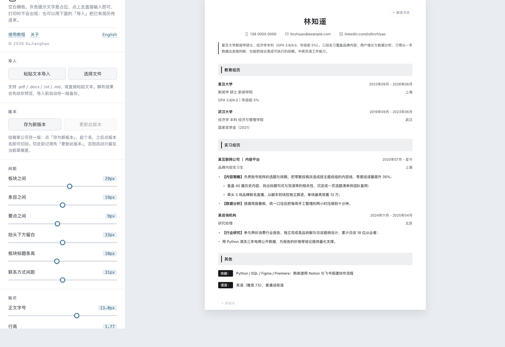

# CV Maker · 简历制作器

> 一个 HTML 文件的简历排版工具。正文点开就改，疏密交给滑杆，一键把内容排满整页。
> 没有账号、没有后端、没有构建工具链 —— 双击就能用，断网也能用。

**[在线使用](https://cv-maker-amp.pages.dev)** · **[下载单文件](https://github.com/eSeaFiller/cv-maker/releases/latest/download/cv-maker.html)** · [English](README.en.md)



## 它解决什么

在线简历网站给你模板，但不给你控制权：行距字号是锁死的，内容少了一页下面空一大块，多一行就被挤到第二页。Word 则相反，什么都能改，但牵一发动全身，调完一处得再收拾三处。

CV Maker 把这两件事拆开：

- **内容**直接在纸面上改 —— 点哪儿改哪儿，没有表单、没有字段弹窗；
- **排版**交给左侧一排滑杆 —— 板块之间、条目之间、要点之间、抬头留白四个层级各有各的间距，互不干扰。

不想手动调就点「排满一页」：它用二分搜索找出「刚好放得下的最松的一组值」，超了收紧、不够撑开，而不是一压到底。

## 几条设计前提

| | |
|---|---|
| **单文件** | 整个工具是一个 1.5 MB 的 `.html`，pdf.js 也内联在里面。微信、邮件、AirDrop 直接发过去，对方双击就能开 |
| **离线可用** | 不依赖任何外部服务，飞机上、地铁里照样编辑和打印；几年后打开还是这样 |
| **简历不出本机** | 正文、照片、所有版本只存在你自己浏览器的 localStorage 里，从不上传（唯一的一次网络请求见[下文](#数据与隐私)） |
| **所见即所印** | 编辑态的高度必须等于打印高度。所有「＋」按钮都是浮动定位，不占布局；空字段在预览和打印里彻底消失 |

## 能做什么

| 功能 | 说明 |
|---|---|
| 逐段编辑 | 姓名、时间、城市、每条要点点开就改。<kbd>Enter</kbd> 新增一条，<kbd>Tab</kbd> 降成子要点、<kbd>⇧Tab</kbd> 退回，空条 <kbd>⌫</kbd> 删除，<kbd>⌘B</kbd> 加粗 |
| 导入已有简历 | 上传 `.pdf` / `.docx` / `.txt` / `.md`，或直接粘贴文本，自动拆成板块、经历、要点。导入前先给你预览，并自动存一版备份 |
| 四级间距 | 板块、条目、要点、抬头留白各有滑杆，另有字号、行高、页边距、姓名字号、联系方式字号 |
| 排满 N 页 | 内容超了自动收紧，不够自动撑开，正好落在一页或两页里 |
| 智能分页 | 会被页边切开的条目整块挪到下一页，页与页之间留出正常的天头地脚。编辑态就把这段空档画出来 —— 屏幕上的空档就是打印出来的空档 |
| 整段拖动 | 停在板块或条目左侧，按住六点手柄把整段拖去别处 |
| 版式风格 | 板块标题三种样式 × 中英文字体 × 四种主题色，标题底色随主题一起变 |
| 中英文双语 | 英文板块名和 `Sep 2022 - Present` 这类日期都认；导入英文简历会自动切到拉丁排版。界面本身也能中英切换 |
| 多版本 | 按公司存档并命名，随时切回；未写回的改动有小蓝点提醒 |
| 备份与打印 | 草稿和全部版本导出成一个 `.json`；一键导出 A4 PDF |

## 怎么用

**方式一**：打开 <https://cv-maker-amp.pages.dev>。

工具里点左上角「使用教程」有一份带插图的上手说明；仓库里的 [`docs/guide.html`](docs/guide.html) 是同一份内容的独立页面，下载下来用浏览器打开即可。

**方式二**：从 [Releases](https://github.com/eSeaFiller/cv-maker/releases/latest) 下载 `cv-maker.html`，双击。就这一个文件，放哪儿都行。

然后三步：

1. **放内容** —— 点左侧「导入」把已有简历传进来（PDF、Word、纯文本都行），或者直接在纸面上从头写。
2. **调排版** —— 先点一次「排满一页」，八成就成了。想再松紧一点，拖对应层级的滑杆微调。
3. **存版本、导出** —— 给每家公司「存为新版本」并命名，再点「打印 / 存为 PDF」，纸张选 A4、边距选「无」。

## 自己改

```
cv-maker.html          构建产物，下载即用
src/
  source.html          源码（正文片段，没有 doctype / <html> / <head>）
  build.py             把 pdf.js 内联进去、包上 doctype，产出根目录的 cv-maker.html
  pdfjs/               pdf.js 3.11.174（Apache-2.0，Mozilla）
docs/
  guide.html           介绍页 / 使用手册
  screenshot.png
```

改完 `src/source.html` 之后：

```bash
python3 src/build.py
```

只需要 Python 3，没有别的依赖，也没有 node_modules。

`source.html` 里全部是原生 HTML/CSS/JS，不用框架、不用打包器 —— 逻辑在一个 IIFE 里，样式在顶部一整块 `<style>` 中。

## 改代码前请先读

这些是踩过坑之后立的规矩，不遵守的话很容易在打印时才发现问题：

1. **所见即所印** —— 编辑态的高度必须等于打印高度。新增的「＋」按钮一律 `position:absolute`，绝不占布局。
2. **空内容在预览和打印里不得留痕** —— 空字段、空要点、占位提示都要消失。注意 <kbd>⌘P</kbd> 可能在编辑态直接触发，所以打印样式要强制回到预览态。
3. **删除键必须是可编辑区的兄弟节点** —— 放进 `contenteditable` 里面会毁掉 `:empty` 占位逻辑，并且会被打字破坏。
4. **不要改 localStorage 键名** —— 会让用户已有的数据变成孤儿。当前是 `resume-desk-blank-v1` / `resume-desk-blank-versions-v1`。
5. **打印时不能只靠背景色** —— 读者常常关掉「背景图形」。板块标题的竖条、自述块的竖线都是用 `border` 画的，就是为了这个。
6. **界面语言只动界面** —— 纸面上的内容一个字都不许跟着变。文案的写法见下。

### 加一句新文案

中文原文就是词典的键，`UI_EN` 里只放英文：

```js
T("删除板块")                     // 中文界面原样返回，英文界面查 UI_EN
T("已载入「{0}」。", v.name)       // {0} 按参数顺序替换
```

静态 HTML 用 `data-i18n="key"` 标记，中文留在标签里，切到英文才换掉、切回来再还原。忘了写词表不会崩，只是那一句还没被翻译。

## 数据与隐私

- 简历正文、照片、全部版本只写进本浏览器的 `localStorage`，**从不上传**。清缓存会一起清掉，所以重要的版本记得用「导出备份文件」存一份 `.json`。
- 工具在**首次打开**时向作者的服务器发一次**空请求**，用来统计有多少人在用 —— 不带 id、不带设备信息、不带简历的任何字节，此后不再发送。开关在「关于」卡片里，随时可关。
- **fork 之后请把 `HIT_URL` 置空**（在 `src/source.html` 里搜 `var HIT_URL`），否则你部署的那份会往作者的计数器上打。置空即等于整个功能不存在。

## 许可

[MIT](LICENSE) © 2026 XuJianghao

内联的 PDF 解析库是 [pdf.js](https://github.com/mozilla/pdf.js) 3.11.174，Apache License 2.0，© Mozilla Foundation —— 许可声明随代码一起打包在产物里。
